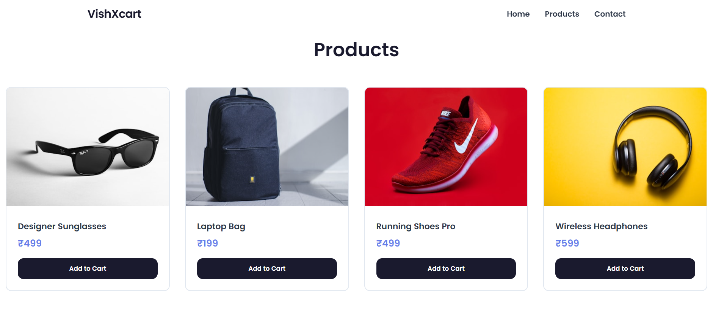

# VishXcart

A clean, **fully responsive shopping cart application** built with React. This project goes beyond the basics, featuring a **modern product grid, dynamic cart badge counter, integrated routing, and an elegant contact form** — all wrapped in a **sleek, mobile-friendly interface**.

## Preview





## Features

* **Modern product grid** – visually appealing layout with consistent spacing and hover effects.
* **Dynamic cart badge counter** – updates instantly as products are added or removed.
* **React Router integration** – seamless page navigation (Home, Products, Cart, Contact).
* **Contact form** – clean, functional form with client-side validation.
* **Fully responsive** – optimized for desktops, tablets, and mobile devices.
* **Simple state management** – built using React hooks (`useState`, `useEffect`) for clarity.
* **Reusable components** – navigation bar, footer, product cards, and form fields are modular and maintainable.
* **Modern UI styling** – clean, minimal design with inline styles or CSS modules (your choice).

## Tech Stack

* **React (Vite or CRA)** – component-based architecture
* **React Router DOM** – for navigation and routing
* **JavaScript (ES6+)** – modern JS features for clean logic
* **CSS / Inline Styles** – responsive, minimal UI design

## What You’ll Learn

* How to structure a React app with **reusable components**.
* Managing **state** for cart items and form inputs.
* Setting up **dynamic routes** with React Router.
* Building a **responsive layout** without bulky CSS frameworks.
* Writing **clean, maintainable code** for real-world apps.

## How to Run

1. Clone the repository:

   ```bash
   git clone https://github.com/Mahadevaprasad17/VishXcart.git
   ```
2. Install dependencies:

   ```bash
   npm install
   ```
3. Start the development server:

   ```bash
   npm start
   ```
4. Open in browser:

   ```
   http://localhost:3000 
   ```
